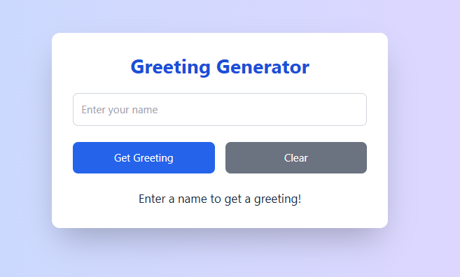

# Hello World Full-Stack Application

A full-stack training project featuring a "Greeting Generator" API built with Node.js and Express, seamlessly integrated with a React frontend powered by Vite. This project demonstrates foundational full-stack development skills, including backend API creation, frontend-backend communication, modern styling with Tailwind CSS, and persistent data storage with SQLite. Created as part of a full-stack development training initiative with The AI Union Agency.

## Tech Stack

- **Backend:** Node.js, Express, CORS, SQLite
- **Frontend:** React, Vite, Tailwind CSS
- **Version Control:** Git, GitHub
- **Development Tools:** VS Code, PowerShell

## Prerequisites

- **Node.js:** v22.12.0 or higher
- **npm:** Latest version (check with `npm -v`)
- **Git:** Installed for version control (check with `git --version`)


Backend Setup

cd backend
npm install
node server.js

Frontend Setup

cd frontend
npm install
npm run dev 

Verify

Backend: Visit http://localhost:5000/greet?name=yourname (shows a random greeting like "Greetings, yourname!").
Frontend: Visit http://localhost:5173, enter a name, and click "Get Greeting" to see the styled form display the greeting. Use the "Clear" button to reset the form.

Restart Commands

Backend (Express Server):

cd backend
# Stop: Ctrl + C
node server.js

Frontend (Vite):
cd frontend
# Stop: Ctrl + C
npm run dev

## Screenshot



## Author

**Abdishakur**  
GitHub: [Engshakta](https://github.com/Engshakta)  


## Setup Instructions

### Clone the Repository

```bash
git clone https://github.com/Engshakta/greeting-generator.git
cd greeting-generator

## Screenshot


## Live Demo

Check out the deployed app here: [https://greeting-generator.vercel.app](https://greeting-generator.vercel.app)

## Author

**Abdishakur**  
GitHub: [Engshakta](https://github.com/Engshakta)  


## Deployment Notes

Attempting to deploy on Vercel with a simplified configuration.